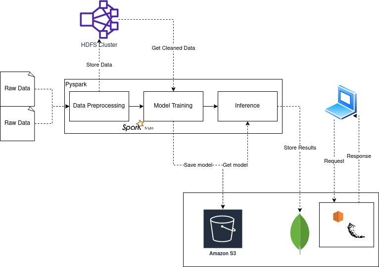

## Pyspark Recommendation System

This is a graduate project for Distributed Systems.

## Tools and Technology used:
- Python
- HDFS
- Docker
- Pyspark
- AWS S3 and EC2
- Flask API

## High Level Architecture

---

## Authors
- Gaurab Subedi
- Siddhi Kiran Bajracharya
- Unish Rarnikar
