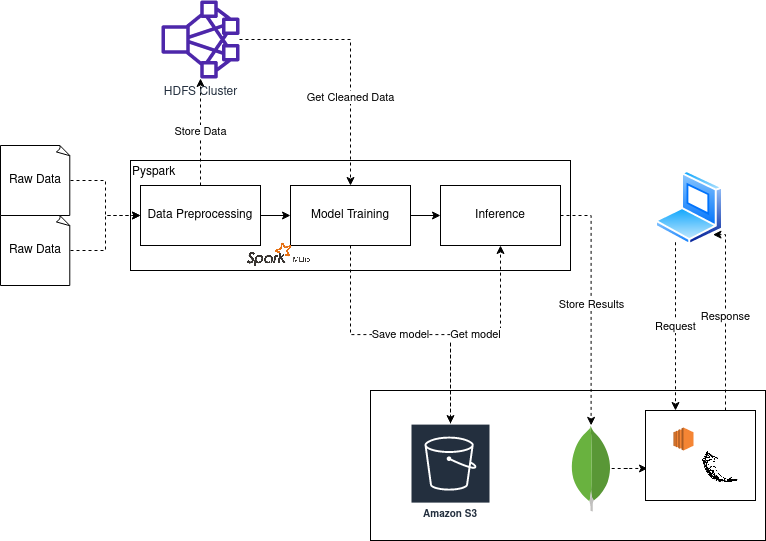

## Pyspark Recommendation System
This is a graduate project for Distributed Systems.

## Tools and Technology used:
- Python
- HDFS
- Docker
- Pyspark
- AWS S3 and EC2
- Flask API

## High Level Architecture


---

## Instruction

Install Java 8. We will be installing java 8 using the [sdkman](https://sdkman.io).

```
curl -s “https://get.sdkman.io" | bash
```

```
source "$HOME/.sdkman/bin/sdkman-init.sh"
```

Check if the sdkman is installed properly

```
sdk version
```

Look for the java 8 version.

```
sdk list java
```

Install java 8 from the list

```
sdk install java 8.0.352-amzn
```

## Authors
- [Gaurab Subedi](mailto:gaurab.subedi@coyotes.usd.edu)
- [Siddhi Kiran Bajracharya](mailto:siddhi.bajracharya@coyotes.usd.edu)
- [Unish Rajkarnikar](mailto:unish.rajkarnikar@coyotes.usd.edu)
